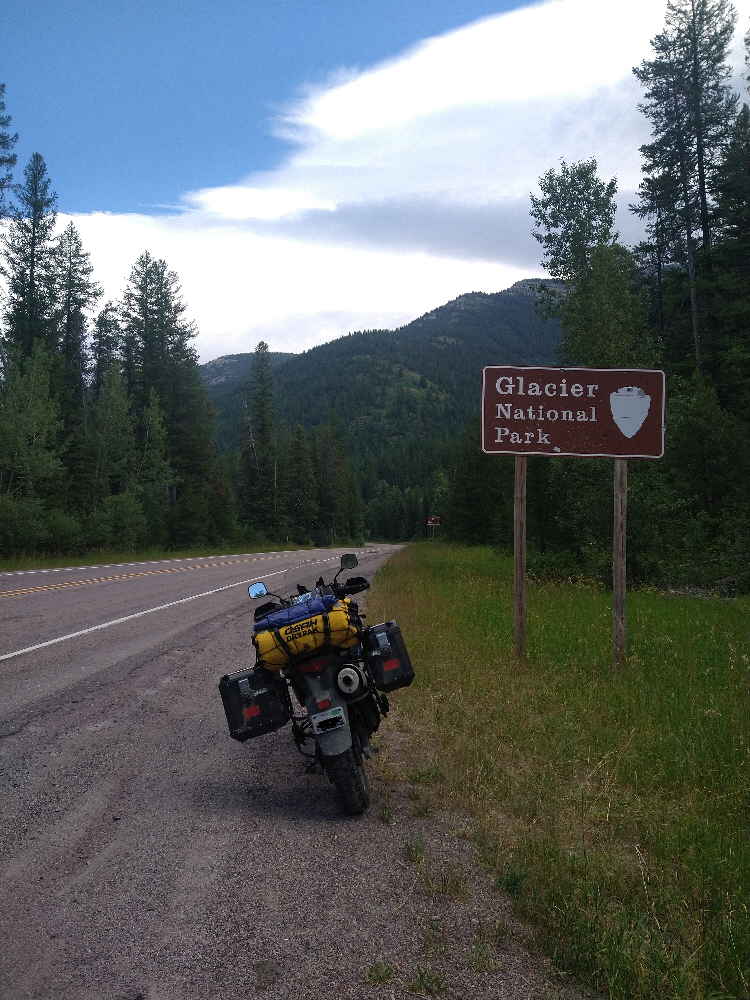
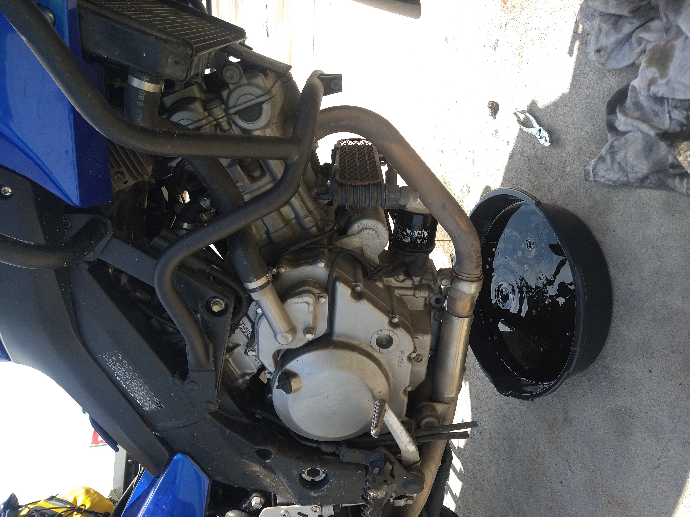
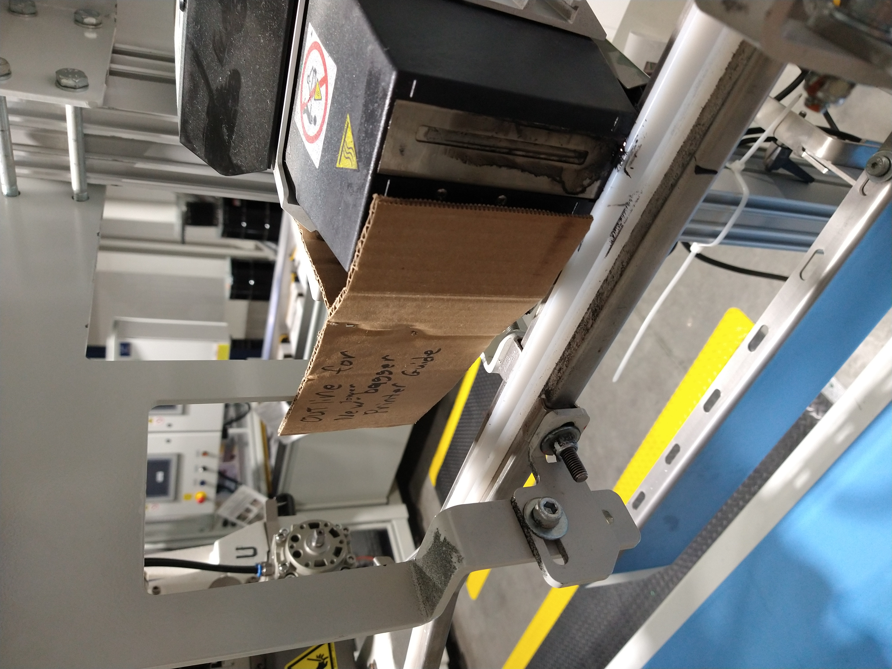
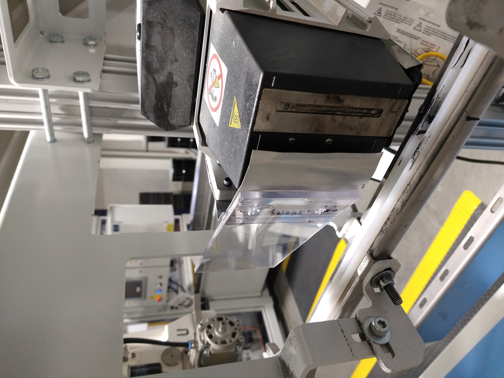
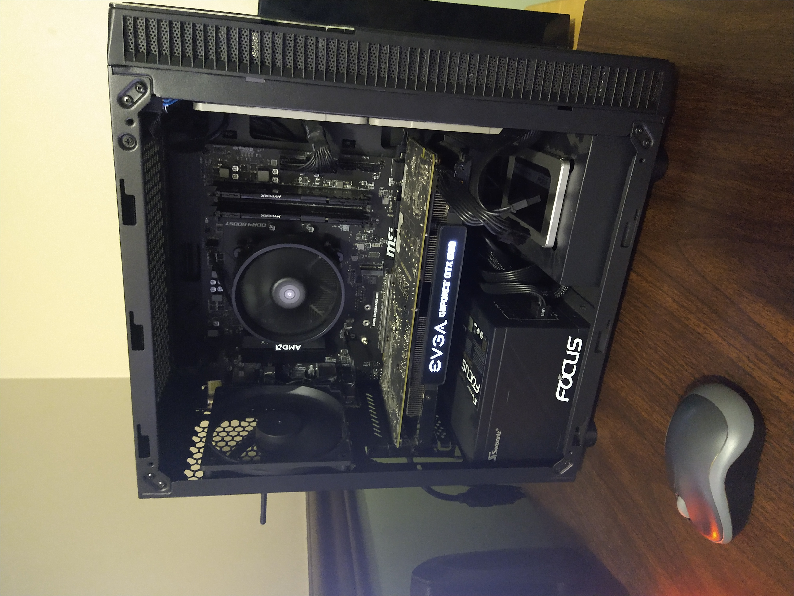

<h1 align="center">
Kenneth VanZuiden
</h1>

# About Me

I am an undergraduate Physics student at Western Illinois University.

# Showcase Contents

1. [Astrophysics Project](#Astrophysics-Project)
2. [Astronomy Outreach Activities](#Astronomy-Outreach-Activities)
3. [Class Work Highlights](#Class-Work-Highlights)
4. [Awards](#Awards)
5. [Personal Hobbies](#Personal-Hobbies)

# Astrophysics Project

This is a overview of the astrophysics project under a professor, Dr. E.D. Araya. This project is part of a international collaboration called VOLS (VLA Orian a Large Survey). With Gaberil Sokia and Dr. E.D. Araya (both of Western Illinions University), we are studying molecular clouds that are often associated with star formation. The following figures are made with the help by Gaberil Sokia and Dr. E.D. Araya. This projected can also found on the 244th American Astronomical Socity [i-poster](https://aas244-aas.ipostersessions.com/default.aspx?s=47-44-56-F3-2D-07-04-0F-ED-65-7E-DA-6A-68-65-29&guestview=true).

#### The Overview

- Using VLA radio telecope, a high resolution scan of the Orian Nebula KL region was done shown in the middle picure below in pink box. Using radio telecope data provided by the VOLS group, we are studying star formation in the Orian Nebula.
- The goal of this project is that we want to do two things. One, we are studying Methonal (*CH3OH*) Masers and Hydroxial (*OH*) Masers. These are situlated molecular clouds that are often associated with star formation. Masers are like Lasers, but instead of amplication of visble light, Masers are the amplication of light in microwave spectum. Two, is test how well calibrated the data is using continuum (the near by stars) as controls. 
- Below is the pelimarly findings. The project is still ongoing and waiting for a final paper to be published.

<table width="100%" border="0">
  <tr>    
  <td></td>
  <td></td>
  <td></td>
  </tr>
</table>

#### Pelimarly Findings

- Below on the left: is a re-detection of the 2005 Voronkov et al. 6.7 GHz *CH3OH* Maser. The graph next to it is the light curve over several epochs spanning over days. This is a graph of peak flux densenisty in mJy (milli-Jenskys = 10^-29 W/(m^2 HZ)) over time, which can be simply interpreted as brightness over time.
- Below on the right: is the continuum controls selected that are near the *CH3OH* Maser. Which also has same kind of light curve for those.
- We found great varibillity in both the *CH3OH* Maser and many continuum controls. There is also a anti-corration behavior with the star next to the *CH3OH* Maser. Which needs to be investigated further. No calibration issues are found as of yet.

<table width="100%" border="0">
  <tr>    
  <td></td>
  <td></td>
  </tr>
</table>

<table width="100%" border="0">
  <tr>    
  <td></td>
  <td></td>
  </tr>
</table>

<table width="100%" border="0">
  <tr>    
  <td></td>
  <td></td>
  </tr>
</table>

#### Presentations of this project

- Below on the left is me presenting with Gaberial Sokjia at the 244th American Astromical Socitiy (June 2024).
- On the right is me presenting at WIU Natural Science Reasech Day (April 2024).

<table width="100%" border="0">
  <tr>    
  <td></td>
  <td></td>
  </tr>
</table>

# Astronomy Outreach Activities
#### April 8th 2024 Solar Eclipse 
- Trip I helped organized with the WIU Physics Club to see totality in Carbondale Illinois. Some of the things I did were: I got trained and certifed to operate a university van for perposes of this trip, and helped trobledshoot issues with Zoom live stream of the telescope with a filter. Below are some picures of this event, including seeing the large solar flare in the left picture!
<table width="1000" border="0">
  <tr>    
  <td width="325"></td>
  <td width="325"></td>
  <td width="350"></td>
  </tr>
</table>

#### Physics Demo Show! (November 30th 2023)
- Showing to aduiance of ~50 people, childern and adults, of how thermal energy can be converted to mechanical energy by using Stirling Engine and simularly to electrical energy with Seebeck Generator.

#### Lewistown Middle School Vist (September 26th 2023)
- Below shows picure of nearby middle school vist to the WIU Physics Department. I am on the left side explaining to the students about the Sun Spotter.

# Class Work Highlights

#### Learning Power Specturm Analysis
- A faviorate tool I learned in Computational Methods is power spectrum analysis. Below on the left *CO2* meansured in Parts-Per-Million from Mauna Loa, Hawaii from 1981 to 1990. On the right is the power spectrum analysis of this data (that I had to figure out how to do as part of this class).  
- There is some kind of oscillating pattern that could be due to some kind of phenomenon...
- Essenally what this tells us that the most typical frencency of this data is 1 per year. Most likely due to winter monthns having the lowest amount of plant growth, indicating the high concentration of *CO2*. While the summer months have less *CO2* concentration due to more plant growth. So it makes this cycle once a year, every year.
 
<table width="100%" border="0">
  <tr>    
  <td></td>
  <td></td>
  </tr>
</table>

#### Using Monti Carlo Method for inregration (Extra Credit)
- I used randomness to find the area under the curve. In Python, programmed method that would take: the function to be integrated, the bounds, and the number of random points to be used. By calculated the ratio of points that are below the fuction curve compared to the total number of points, I can make decent approximations of integrals. Examples shown below.
 
<table width="100%" border="0">
  <tr>    
  <td></td>
  <td></td>
  </tr>
</table>

# Awards

#### Outstanding Jounior Award and Excellance in Service Award (May 2024)
 

# Personal Hobbies

<table width="100%" border="0">
  <tr>    
  <td></td>
  <td></td>
  <td></td>
  <td></td>
  <td></td>
  </tr>
  <tr> 
  <td></td>
  <td></td>
  <td></td>
  <td></td>
  <td></td>
  </tr>
</table>

<h1 align="center">
Thank you for checking this out!
</h1>
