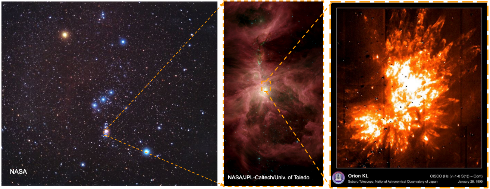

<h1 align="center">
Kenneth VanZuiden
</h1>

# About Me

I am an undergraduate physics student at Western Illinois University, current Astrophysics Research Assist and a Firearms Assembler in my college breaks. Below highlights many things I have done. Many times are instances of problem solving, which I do enjoy a lot.

# Showcase Contents

1. [Astrophysics Project](#Astrophysics-Project)
2. [Astronomy Outreach Activities](#Astronomy-Outreach-Activities)
3. [Class Work Highlights](#Class-Work-Highlights)
4. [Awards](#Awards)

# Astrophysics Project

This is an overview of the astrophysics project under a professor, Dr. E.D. Araya. This project is part of an international collaboration called VOLS (VLA Orian a Large Survey). With Gaberil Sojka and Dr. E.D. Araya (both of Western Illinois University), we are studying molecular clouds that are often associated with star formation. The following figures are made with the help of Gaberil Sojka and Dr. E.D. Araya. This project can also be found on the 244th American Astronomical Society [i-poster](https://aas244-aas.ipostersessions.com/default.aspx?s=47-44-56-F3-2D-07-04-0F-ED-65-7E-DA-6A-68-65-29&guestview=true).

#### The Overview

- Using the VLA radio telescope, a high resolution scan of the Orion Nebula KL region was done (shown in the middle picture below in the pink box). Using radio telescope data provided by the VOLS group, we are studying star formation in the Orion Nebula.
- The goal of this project is that we want to do two things. One, we are studying Methanol (*CH3OH*) Masers and Hydroxial (*OH*) Masers. These are stimulated molecular clouds that are often associated with star formation. Masers are like Lasers, but instead of amplification of visible light, Masers are the amplification of light in the microwave spectrum. Two, is to test how well calibrated the data is using continuum (the nearby stars) as controls.
- Below are the preliminary findings. The project is still ongoing and waiting for a final paper to be published.

<table width="100%" border="0">
  <tr>    
  <td></td>
  <td></td>
  <td></td>
  </tr>
</table>

#### Pelimarly Findings

- Below on the left: is a re-detection of the 2005 Voronkov et al. 6.7 GHz *CH3OH* Maser. The graph next to it is the light curve over several epochs spanning over days. This is a graph of peak flux density in mJy (milli-Jenskys = 10^-29 W/(m^2 HZ)) over time, which can be simply interpreted as brightness over time.
- Below on the right: is the continuum controls selected that are near the *CH3OH* Maser. Which also has the same kind of light curve for those.
- We found great variability in both the *CH3OH* Maser and many continuum controls. There is also a anti-correlation behavior with the star next to the *CH3OH* Maser. Which needs to be investigated further. No calibration issues are found as of yet.

<table width="1000" border="0">
  <tr>    
  <td width="500"></td>
  <td width="500"></td>
  </tr>
</table>

<table width="1000" border="0">
  <tr>    
  <td width="500"></td>
  <td width="500"></td>
  </tr>
</table>

<table width="100%" border="0">
  <tr>    
  <td></td>
  <td></td>
  </tr>
</table>

#### Presentations of this project

- Below on the left is me presenting with Gaberial Sokjia at the 244th American Astronomical Society (June 2024).
- On the right is me presenting at WIU Natural Science Research Day (April 2024).

<table width="1000" border="0">
  <tr>    
  <td width="500"></td>
  <td width="500"></td>
  </tr>
</table>

# Astronomy Outreach Activities
#### April 8th 2024 Solar Eclipse
- Trip I helped organize with the WIU Physics Club to see totality in Carbondale Illinois. Some of the things I did were: I got trained and certified to operate a university van for purposes of this trip, and helped troubleshoot issues with the Zoom live stream of the telescope with a filter. Below are some pictures of this event, including seeing the large solar flare in the left picture!
<table width="1000" border="0">
  <tr>    
  <td width="333"></td>
  <td width="333"></td>
  <td width="334"></td>
  </tr>
</table>

#### Physics Demo Show! (November 30th 2023)
- Showing to an audience of ~50 people, children and adults, how thermal energy can be converted to mechanical energy by using Stirling Engine and similarly to electrical energy with Seebeck Generator.

#### Lewistown Middle School Visit (September 26th 2023)
- Below shows a picture of nearby middle school visiting the WIU Physics Department. I am on the left side explaining to the students about the Sun Spotter.

# Class Work Highlights

#### Learning Power Spectrum Analysis
- A favorite tool I learned in Computational Methods is power spectrum analysis. Below on the left *CO2* measured in Parts-Per-Million from Mauna Loa, Hawaii from 1981 to 1990. On the right is the power spectrum analysis of this data (that I had to figure out how to do as part of this class).  
- There is some kind of oscillating pattern that could be due to some kind of phenomenon...
- Essentially what this tells us is that the most typical frequency of this data is 1 per year. Most likely due to winter months having the lowest amount of plant growth, indicating the high concentration of *CO2*. While the summer months have less *CO2* concentration due to more plant growth. So it makes this cycle once a year, every year.
 
<table width="100%" border="0">
  <tr>    
  <td></td>
  <td></td>
  </tr>
</table>

#### Using Monte Carlo Method for integration (Extra Credit)
- I used randomness to find the area under the curve. In Python, I programmed a method that would take: the function to be integrated, the bounds, and the number of random points to be used. By calculating the ratio of points that are below the function curve compared to the total number of points, I can make decent approximations of integrals. Examples shown below.
 
<table width="100%" border="0">
  <tr>    
  <td></td>
  <td></td>
  </tr>
</table>

# Awards

#### Frank E. Rodeffer Scholarship, $3100 Total (Fall 2023, Spring 2023, Fall 2024)

#### Walter Eller Physics Scholarship $600 (Fall 2024)

#### Outstanding Junior Award and Excellence in Service Award (May 2024)
 

#### 1st Place Undergrad Oral Presentation in Physics, Mathematics, & Astronomy Ilinois State Academy of Science, Millikin University (April 2024)
- Presenting "Identifying Radio Continuum Controls to Characterize Variability of Methanol Masers in the Orion Nebula"

#### Norman & Carmelita Teeter Undergraduate Research Award $300 (Spring 2024)

#### 1st Place Physics Natural Sciences Research Day, Western Illinois University (April 2024)
- Presenting "Identifying Radio Continuum Controls to Characterize Variability of Methanol Masers in the Orion Nebula"

#### Robert Noyce Teacher Scholarship $430 (Fall 2023)

#### 3rd Place Skadron Prize Programming Competition, Illinois State University (May 2021)

<table width="800" border="0" align="center">
  <tr>    
  <td width="400"></td>
  <td width="400"></td>
  </tr>
</table>

<h1 align="center">
Thank you for checking this out!
</h1>
