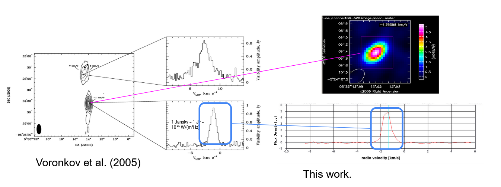

<h1 align="center">
Kenneth VanZuiden
</h1>

# About Me

I am an undergraduate Physics student at Western Illinois University.

# Showcase Contents

1. [Astrophysics Project](#Astrophysics-Project)
2. [Astronomy Outreach Activities](#Astronomy-Outreach-Activities)
3. [Class Work Highlights](#Class-Work-Highlights)
4. [Personal Hobbies](#Personal-Hobbies)

# Astrophysics Project

This is a overview of the astrophysics project, which is in collaboration of many indivisuals. Mainly with Gaberil Sokia and Dr. E.D. Araya (both of Western Illinions University). Figures are by Gaberil Sokia and Dr. E.D. Araya unless otherwise stated. Most of this is also found on the 244th American Astronomical Socity [i-poster](https://aas244-aas.ipostersessions.com/default.aspx?s=47-44-56-F3-2D-07-04-0F-ED-65-7E-DA-6A-68-65-29&guestview=true).

- Using VLA radio telecope data provided by VOLS group (VLA Orian a Large Survey), we are studying star formation in the Orian Nebula.
- The brief overview of this project is that we want to do two things. One, we are studying Methonal (*CH3OH*) Masers and Hydroxial (*OH*) Masers. These are situlated molecular clouds that are often associated with star formation. Masers are like Lasers, but instead of amplication of visble light, Masers are the amplication of light in microwave spectum. Two, is test how well calibrated the data is using continuum (the near by stars) as controls. 
- Below is the pelimarly findings. The project is still ongoing and waiting for a final paper to be published.

<table width="100%" border="0">
  <tr>    
  <td></td>
  <td></td>
  <td></td>
  </tr>
</table>

<table width="100%" border="0">
  <tr>    
  <td></td>
  <td></td>
  </tr>
</table>

<table width="100%" border="0">
  <tr>    
  <td></td>
  <td></td>
  </tr>
</table>

<table width="100%" border="0">
  <tr>    
  <td></td>
  <td></td>
  </tr>
</table>

# Astronomy Outreach Activities
#### April 8th 2024 Solar Eclipse 
Trip I helped organized with the WIU Physics Club to see totality in Carbondale Illinois. Some of the things I did were: I got trained and certifed to operate a university van for perposes of this trip, and helped trobledshoot issues with Zoom live stream of the telescope with a filter. Below are some picures of this event, including seeing the large solar flare in the left picture!
<table width="100%" border="0">
  <tr>    
  <td></td>
  <td></td>
  <td></td>
  </tr>
</table>

#### Lewistown Middle School Vist

# Class Work Highlights

# Personal Hobbies
